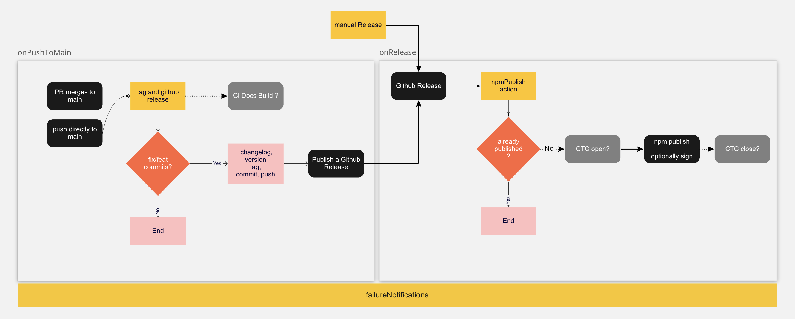

# Github Workflows

Reusable workflows and actions

## Opinionated publish process for npm

> github is the source of truth for code AND releases. Get the version/tag/release right on github, then publish to npm based on that.



1. work on a feature branch, commiting with conventional-commits
2. merge to main
3. A push to main produces (if your commits have `fix:` or `feat:`) a bumped package.json and a tagged github release via `githubRelease`
4. A release cause `npmPublish` to run, releasing the package as `latest`

Just need to publish to npm? You could use any public action to do step 4.
Use this repo's `npmPublish` if you need either

1. codesigning for Salesforce CLIs
2. integration with CTC
   or if you own other repos that need those features and just want consistency.

### githubRelease

> creates a github release based on conventional commit prefixes. Using commits like `fix: etc` (patch version) and `feat: wow` (minor version) or any valid prefix with a `!` like `feat!:` (major version) will cause the action to update the packageVersion, produce a changelog, tag and release.

```yml
name: version, tag and github release

on:
  push:
    branches: [main]

jobs:
  release:
    uses: salesforcecli/github-workflows/.github/workflows/githubRelease.yml@main
    secrets: inherit
```

### npmPublish

> This will verify that the version has not already been published. There are additional params for signing your plugin and integrating with Change Traffic Control (release moratoriums) that you probably only care about if your work for Salesforce.

example usage

```yml
on:
  release:
    # both release and prereleases
    types: [published]
  # support manual release in case something goes wrong and needs to be repeated or tested
  workflow_dispatch:
    inputs:
      tag:
        description: github tag that needs to publish
        type: string
        required: true
jobs:
  getDistTag:
    outputs:
      tag: ${{ steps.distTag.outputs.tag }}
    runs-on: ubuntu-latest
    steps:
      - uses: actions/checkout@v3
        with:
          ref: ${{ github.event.release.tag_name || inputs.tag  }}
      # derive an npm dist tag fro the package.json version (ex: beta or dev)
      - uses: salesforcecli/github-workflows/.github/actions/getPreReleaseTag@prerelease-cca
        id: distTag
  npm:
    uses: salesforcecli/github-workflows/.github/workflows/npmPublish.yml@main
    needs: [getDistTag]
    with:
      # usually true or false, but this says, "only use ctc when publishing latest, not a prerelease"
      ctc: ${{ !needs.getDistTag.outputs.tag }}
      sign: true
      tag: ${{ needs.getDistTag.outputs.tag || latest }}
      githubTag: ${{ github.event.release.tag_name || inputs.tag }}

    secrets: inherit
```

### supporting npm prereleases

Modify your `package.json`'s version to be `x.y.z-beta` where `beta` is the dist tag you want to publish under.
Modify the above 2 files to accommodate pre-releases on non-main branch.

`onPushToMain`

```yml
name: version, tag and github release

on:
  push:
    branches: [main, other-branch]

jobs:
  release:
    uses: salesforcecli/github-workflows/.github/workflows/githubRelease.yml@main
    secrets: inherit
    with:
      prerelease: ${{ github.ref_name != 'main' }}
  ...
```

if you use the docs job, also modify it to not do docs off of main

`onPushToMain`

```
  ...
  docs:
    if: ${{ github.ref_name == 'main' }}
    ...
```

## Opinionated Testing Process

Write unit tests to tests units of code (a function/method)
Write not-unit-tests to tests larger parts of code (a command) against real environments/APIs
Run the UT first (faster, less expensive for infrastructure/limits)

```yml
name: tests
on:
  push:
    branches-ignore: [main]
  workflow_dispatch:

jobs:
  unit-tests:
    uses: salesforcecli/github-workflows/.github/workflows/unitTest.yml@main
  nuts:
    needs: unit-tests
    uses: salesforcecli/github-workflows/.github/workflows/nut.yml@main
    secrets: inherit
    strategy:
      matrix:
        os: [ubuntu-latest, windows-latest]
      fail-fast: false
    with:
      os: ${{ matrix.os }}
```

## Other Tooling

### validatePR

> requires PR reference a github issue url or a GUS WI surrounded by `@` (`@W-xxxxxxxx@`)

```yml
name: pr-validation

on:
  pull_request:
    types: [opened, reopened, edited]
    # only applies to PRs that want to merge to main
    branches: [main]

jobs:
  pr-validation:
    uses: salesforcecli/github-workflows/.github/workflows/validatePR.yml@main
```

### nut conditional on commit message

```yml
# conditional nuts based on commit message includes a certain string
sandbox-nuts:
  needs: [nuts, unit-tests]
  if: contains(github.event.push.head_commit.message,'[sb-nuts]')
  uses: salesforcecli/github-workflows/.github/workflows/nut.yml@main
  secrets: inherit
  with:
    command: test:nuts:sandbox
    os: ubuntu-latest
```

### externalNut

> Scenario
>
> 1. you have NUTs on a plugin that uses a library
> 2. you want to check changes to the library against those NUTs

see https://github.com/forcedotcom/source-deploy-retrieve/blob/> e09d635a7b852196701e71a4b2fba401277da313/.github/workflows/test.yml#L25 for an example

### automerge

> This example calls the automerge job. It'll merge PRs from dependabot that are
>
> 1. up to date with main
> 2. mergeable (per github)
> 3. all checks have completed and none failed (skipped may not have run)

```yml
name: automerge
on:
  workflow_dispatch:
  schedule:
    - cron: "56 2,5,8,11 * * *"

jobs:
  automerge:
    uses: salesforcecli/github-workflows/.github/workflows/automerge.yml@main
    # secrets are needed
    secrets: inherit
```

need squash?

```yml
automerge:
  with:
    mergeMethod: squash
```

### versionInfo

> requires npm to exist. Use in a workflow that has already done that
>
> given an npmTag (ex: `7.100.0` or `latest`) returns the numeric version (`foo` => `7.100.0`) plus > the xz linux tarball url and the short (7 char) sha.
>
> Intended for releasing CLIs, not for general use on npm packages.

```yml
# inside steps
- uses: salesforcecli/github-workflows/.github/actions/versionInfo@main
  id: version-info
  with:
    version: ${{ inputs.version }}
    npmPackage: sfdx-cli
- run: echo "version is ${{ steps.version-info.outputs.version }}
- run: echo "sha is ${{ steps.version-info.outputs.sha }}
- run: echo "url is ${{ steps.version-info.outputs.url }}
```

### validatePR

> Checks PRs have a link to a github issue OR a GUS WI in the form of `@W-12456789@` (the `@` are to be compatible with [git2gus](https://github.com/forcedotcom/git2gus))

```yml
name: pr-validation

on:
  pull_request:
    types: [opened, reopened, edited]
    # only applies to PRs that want to merge to main
    branches: [main]

jobs:
  pr-validation:
    uses: salesforcecli/github-workflows/.github/workflows/validatePR.yml@main
```

### prNotification

> Mainly used to notify Slack when Pull Requests are opened.
>
> For more info see [.github/actions/prNotification/README.md](.github/actions/prNotification/README.md)

```yaml
name: Slack Pull Request Notification

on:
  pull_request:
    types: [opened, reopened]

jobs:
  build:
    runs-on: ubuntu-latest
    steps:
      - name: Notify Slack on PR open
        env:
          WEBHOOK_URL: ${{ secrets.SLACK_WEBHOOK_URL }}
          PULL_REQUEST_AUTHOR_ICON_URL: ${{ github.event.pull_request.user.avatar_url }}
          PULL_REQUEST_AUTHOR_NAME: ${{ github.event.pull_request.user.login }}
          PULL_REQUEST_AUTHOR_PROFILE_URL: ${{ github.event.pull_request.user.html_url }}
          PULL_REQUEST_BASE_BRANCH_NAME: ${{ github.event.pull_request.base.ref }}
          PULL_REQUEST_COMPARE_BRANCH_NAME: ${{ github.event.pull_request.head.ref }}
          PULL_REQUEST_NUMBER: ${{ github.event.pull_request.number }}
          PULL_REQUEST_REPO: ${{ github.event.pull_request.head.repo.name }}
          PULL_REQUEST_TITLE: ${{ github.event.pull_request.title }}
          PULL_REQUEST_URL: ${{ github.event.pull_request.html_url }}
        uses: salesforcecli/github-workflows/.github/actions/prNotification@main
```
