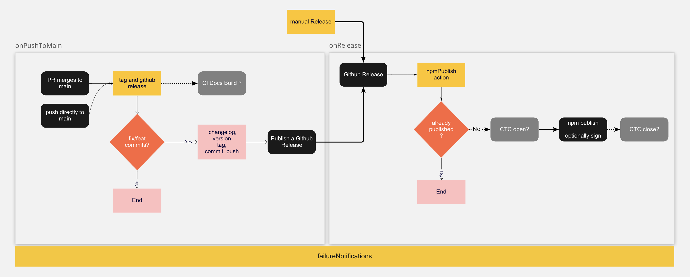

# Github Workflows

Reusable workflows and actions

> [!IMPORTANT]
> Many of these workflows require a Personal Access Token to function.
>
> - Create a new PAT with Repo access
>   - It is recommended that this is a service account user
>   - Note: This user/bot will need to have access to push to your repo's default branch. This can be configured in the branch protection rules.
> - Add the PAT as an Actions [Organization secret](https://github.com/organizations/salesforcecli/settings/secrets/actions)
>   - Set the `Name` to `SVC_CLI_BOT_GITHUB_TOKEN`
>   - Paste in your new PAT as the `Value`
>   - Set `Repository Access` to 'Selected Repositories'
>   - Click the gear icon to select repos that need access to the PAT
>     - This can be edited later
>   - Click `Add Secret`

## Opinionated publish process for npm

> github is the source of truth for code AND releases. Get the version/tag/release right on github, then publish to npm based on that.



1. work on a feature branch, commiting with conventional-commits
2. merge to main
3. A push to main produces (if your commits have `fix:` or `feat:`) a bumped package.json and a tagged github release via `githubRelease`
4. A release cause `npmPublish` to run.

Just need to publish to npm? You could use any public action to do step 4.
Use this repo's `npmPublish` if you need either

1. codesigning for Salesforce CLIs
2. integration with CTC
   or if you own other repos that need those features and just want consistency.

### githubRelease

> creates a github release based on conventional commit prefixes. Using commits like `fix: etc` (patch version) and `feat: wow` (minor version).
> A commit whose **body** (not the title) contains `BREAKING CHANGES:` will cause the action to update the packageVersion to the next major version, produce a changelog, tag and release.

```yml
name: create-github-release

on:
  push:
    branches: [main]

jobs:
  release:
    uses: salesforcecli/github-workflows/.github/workflows/create-github-release.yml@main
    secrets: inherit
    # you can also pass in values for the secrets
    # secrets:
    #  SVC_CLI_BOT_GITHUB_TOKEN: gh_pat00000000
```

### npmPublish

> This will verify that the version has not already been published. There are additional params for signing your plugin and integrating with Change Traffic Control (release moratoriums) that you probably only care about if your work for Salesforce.

example usage

```yml
on:
  release:
    # the result of the githubRelease workflow
    types: [published]

jobs:
  my-publish:
    uses: salesforcecli/github-workflows/.github/workflows/npmPublish.yml
    with:
      tag: latest
      githubTag: ${{ github.event.release.tag_name }}
    secrets: inherit
    # you can also pass in values for the secrets
    # secrets:
    #  NPM_TOKEN: ^&*$
```

works with npm, too

```yml
with:
  packageManager: npm
```

### Plugin Signing

Plugins created by Salesforce teams can be signed automatically with `sign:true` if the repo is in [salesforcecli](https://github.com/salesforcecli) or [forcedotcom](https://github.com/forcedotcom) gitub organization.

You'll need the CLI team to enable your repo for signing. Ask in https://salesforce-internal.slack.com/archives/C0298EE05PU

Plugin signing is not available outside of Salesforce. Your users can add your plugin to their allow list (`unsignedPluginAllowList.json`)

```yml
on:
  release:
    # the result of the githubRelease workflow
    types: [published]

jobs:
  my-publish:
    uses: salesforcecli/github-workflows/.github/workflows/npmPublish.yml
    with:
      sign: true
      tag: latest
      githubTag: ${{ github.event.release.tag_name }}
    secrets: inherit
```

### Prereleases

`main` will release to `latest`. Other branches can create github prereleases and publish to other npm dist tags.

You can create a prerelease one of two ways:

1. Create a branch with the `prerelease/**` prefix. Example `prerelease/my-fix`
   1. Once a PR is opened, every commit pushed to this branch will create a prerelease
   2. The default prerelease tag will be `dev`. If another tag is desired, manually set it in your `package.json`. Example: `1.2.3-beta.0`
1. Manually run the `create-github-release` workflow in the Actions tab
   1. Click `Run workflow`
      1. Select the branch you want to create a prerelease from
      1. Enter the desired prerelease tag: `dev`, `beta`, etc

> [!NOTE]  
> Since conventional commits are used, there is no need to manually remove the prerelease tag from your `package.json`. Once the PR is merged into `main`, conventional commits will bump the version as expected (patch for `fix:`, minor for `feat:`, etc)

Setup:

1. Configure the branch rules for wherever you want to release from
1. Modify your release and publish workflows like the following

```yml
name: create-github-release

on:
  push:
    branches:
      - main
      # point at specific branches, or a naming convention via wildcard
      - prerelease/**
    tags-ignore:
      - '*'
  workflow_dispatch:
    inputs:
      prerelease:
        type: string
        description: 'Name to use for the prerelease: beta, dev, etc. NOTE: If this is already set in the package.json, it does not need to be passed in here.'

jobs:
  release:
    uses: salesforcecli/github-workflows/.github/workflows/create-github-release.yml@main
    secrets: inherit
    with:
      prerelease: ${{ inputs.prerelease }}
      # If this is a push event, we want to skip the release if there are no semantic commits
      # However, if this is a manual release (workflow_dispatch), then we want to disable skip-on-empty
      # This helps recover from forgetting to add semantic commits ('fix:', 'feat:', etc.)
      skip-on-empty: ${{ github.event_name == 'push' }}
```

```yml
name: publish

on:
  release:
    # both release and prereleases
    types: [published]
  # support manual release in case something goes wrong and needs to be repeated or tested
  workflow_dispatch:
    inputs:
      tag:
        description: github tag that needs to publish
        type: string
        required: true

jobs:
  # parses the package.json version and detects prerelease tag (ex: beta from 4.4.4-beta.0)
  getDistTag:
    outputs:
      tag: ${{ steps.distTag.outputs.tag }}
    runs-on: ubuntu-latest
    steps:
      - uses: actions/checkout@v4
        with:
          ref: ${{ github.event.release.tag_name || inputs.tag  }}
      - uses: salesforcecli/github-workflows/.github/actions/getPreReleaseTag@main
        id: distTag

  npm:
    uses: salesforcecli/github-workflows/.github/workflows/npmPublish.yml@main
    needs: [getDistTag]
    with:
      tag: ${{ needs.getDistTag.outputs.tag || 'latest' }}
      githubTag: ${{ github.event.release.tag_name || inputs.tag }}
    secrets: inherit
```

### Publishing from multiple long-lived branches

> In this example `main` publishes to npm on a 1.x.x version and uses `latest`. `some-other-branch` publishes version 2.x.x and uses the `v2` dist tag

```yml
name: version, tag and github release

on:
  push:
    # add the other branch so that it causes github releases just like main does
    branches: [main, some-other-branch]

jobs:
  release:
    uses: salesforcecli/github-workflows/.github/workflows/githubRelease.yml@main
    secrets: inherit
```

```yml
on:
  release:
    # the result of the githubRelease workflow
    types: [published]

jobs:
  my-publish:
    uses: salesforcecli/github-workflows/.github/workflows/npmPublish.yml
    with:
      # ternary-ish https://github.com/actions/runner/issues/409#issuecomment-752775072
      # if the version is 2.x we release it on the `v2` dist tag
      tag: ${{ startsWith( github.event.release.tag_name || inputs.tag, '1.') && 'latest' || 'v2'}}
      githubTag: ${{ github.event.release.tag_name }}
    secrets: inherit
```

## Opinionated Testing Process

Write unit tests to tests units of code (a function/method).

Write not-unit-tests to tests larger parts of code (a command) against real environments/APIs.

Run the UT first (faster, less expensive for infrastructure/limits).

```yml
name: tests
on:
  push:
    branches-ignore: [main]
  workflow_dispatch:

jobs:
  unit-tests:
    uses: salesforcecli/github-workflows/.github/workflows/unitTest.yml@main
  nuts:
    needs: unit-tests
    uses: salesforcecli/github-workflows/.github/workflows/nut.yml@main
    secrets: inherit
    strategy:
      matrix:
        os: [ubuntu-latest, windows-latest]
      fail-fast: false
    with:
      os: ${{ matrix.os }}
```

## Other Tooling

### nut conditional on commit message

```yml
# conditional nuts based on commit message includes a certain string
sandbox-nuts:
  needs: [nuts, unit-tests]
  if: contains(github.event.push.head_commit.message,'[sb-nuts]')
  uses: salesforcecli/github-workflows/.github/workflows/nut.yml@main
  secrets: inherit
  with:
    command: test:nuts:sandbox
    os: ubuntu-latest
```

### externalNut

> Scenario
>
> 1. you have NUTs on a plugin that uses a library
> 2. you want to check changes to the library against those NUTs

see https://github.com/forcedotcom/source-deploy-retrieve/blob/> e09d635a7b852196701e71a4b2fba401277da313/.github/workflows/test.yml#L25 for an example

### automerge

> This example calls the automerge job. It'll merge PRs from dependabot that are
>
> 1. up to date with main
> 2. mergeable (per github)
> 3. all checks have completed and none failed (skipped may not have run)

```yml
name: automerge
on:
  workflow_dispatch:
  schedule:
    - cron: '56 2,5,8,11 * * *'

jobs:
  automerge:
    uses: salesforcecli/github-workflows/.github/workflows/automerge.yml@main
    # secrets are needed
    secrets: inherit
```

need squash?

```yml
automerge:
  with:
    mergeMethod: squash
```

### versionInfo

> requires npm to exist. Use in a workflow that has already done that
>
> given an npmTag (ex: `7.100.0` or `latest`) returns the numeric version (`foo` => `7.100.0`) plus > the xz linux tarball url and the short (7 char) sha.
>
> Intended for releasing CLIs, not for general use on npm packages.

```yml
# inside steps
- uses: salesforcecli/github-workflows/.github/actions/versionInfo@main
  id: version-info
  with:
    version: ${{ inputs.version }}
    npmPackage: sfdx-cli
- run: echo "version is ${{ steps.version-info.outputs.version }}
- run: echo "sha is ${{ steps.version-info.outputs.sha }}
- run: echo "url is ${{ steps.version-info.outputs.url }}
```

### validatePR

> Checks that PRs have a link to a github issue OR a GUS WI in the form of `@W-12456789@` (the `@` are to be compatible with [git2gus](https://github.com/forcedotcom/git2gus))

```yml
name: pr-validation

on:
  pull_request:
    types: [opened, reopened, edited]
    # only applies to PRs that want to merge to main
    branches: [main]

jobs:
  pr-validation:
    uses: salesforcecli/github-workflows/.github/workflows/validatePR.yml@main
```

### prNotification

> Mainly used to notify Slack when Pull Requests are opened.
>
> For more info see [.github/actions/prNotification/README.md](.github/actions/prNotification/README.md)

```yaml
name: Slack Pull Request Notification

on:
  pull_request:
    types: [opened, reopened]

jobs:
  build:
    runs-on: ubuntu-latest
    steps:
      - name: Notify Slack on PR open
        env:
          WEBHOOK_URL: ${{ secrets.SLACK_WEBHOOK_URL }}
          PULL_REQUEST_AUTHOR_ICON_URL: ${{ github.event.pull_request.user.avatar_url }}
          PULL_REQUEST_AUTHOR_NAME: ${{ github.event.pull_request.user.login }}
          PULL_REQUEST_AUTHOR_PROFILE_URL: ${{ github.event.pull_request.user.html_url }}
          PULL_REQUEST_BASE_BRANCH_NAME: ${{ github.event.pull_request.base.ref }}
          PULL_REQUEST_COMPARE_BRANCH_NAME: ${{ github.event.pull_request.head.ref }}
          PULL_REQUEST_NUMBER: ${{ github.event.pull_request.number }}
          PULL_REQUEST_REPO: ${{ github.event.pull_request.head.repo.name }}
          PULL_REQUEST_TITLE: ${{ github.event.pull_request.title }}
          PULL_REQUEST_URL: ${{ github.event.pull_request.html_url }}
        uses: salesforcecli/github-workflows/.github/actions/prNotification@main
```

## VS Code Extension Workflows

This repository includes reusable workflows for VS Code extension CI/CD, supporting both monorepo and single-extension repositories.

### Prerequisites

Before using these workflows, ensure your repository has:

1. **Required Secrets** (configured as GitHub Actions secrets):
   - `IDEE_GH_TOKEN` - Personal Access Token with repo permissions for creating releases and pushing tags
   - `VSCE_PERSONAL_ACCESS_TOKEN` - VS Code Marketplace Personal Access Token ([create one](https://code.visualstudio.com/api/working-with-extensions/publishing-extension#get-a-personal-access-token))
   - `IDEE_OVSX_PAT` - Open VSX Personal Access Token ([create one](https://open-vsx.org/user-settings/tokens))

2. **Repository Structure**:
   - For monorepos: Extensions under a common directory (default: `packages/`)
   - For single repos: Extension at repository root
   - Each extension must have a valid `package.json` with VS Code extension metadata

3. **Optional Local Actions** (only for `vscode-manual-publish.yml` and `vscode-promote-stable.yml`):
   - `.github/actions/npm-install-with-retries` - Custom npm install with retry logic
   - `.github/actions/check-ci-status` - Validates CI checks passed before publish
   - `.github/actions/repackage-vsix-stable` - Repackages pre-release VSIX as stable
   - `.github/actions/publish-vsix` - Publishes to VS Code Marketplace and/or Open VSX

   Note: Most workflows (like `vscode-publish-extensions.yml` and `vscode-promote-prerelease.yml`) are fully self-contained and don't require these local actions.

### Architecture Overview

The VS Code workflows follow a modular design:

1. **CI/Testing** (`vscode-ci-template.yml`) - Lints, compiles, and tests across multiple OS/Node versions
2. **Packaging** (`vscode-package.yml`) - Creates VSIX files without publishing
3. **Publishing** (`vscode-publish-extensions.yml`) - Complete release pipeline with version bumping and marketplace publishing
4. **Promotion** (`vscode-promote-prerelease.yml`, `vscode-promote-stable.yml`) - Promotes vetted builds between release channels

### Versioning Strategy

These workflows use an **odd/even minor version convention** to distinguish release types:

- **Nightly builds**: Odd minor versions (e.g., `0.5.x-nightly.20260709`)
- **Pre-release**: Odd minor versions (e.g., `0.5.3`)
- **Stable releases**: Even minor versions (e.g., `0.6.0`)

**Benefits:**
- Clear visual distinction between release channels
- Prevents accidental overwrites
- Predictable version progression: nightly `0.5.x` → pre-release `0.5.y` → stable `0.6.0`

**Version bump types:**
- `major`: Breaking change → next major with first odd minor (e.g., `0.5.3` → `1.1.0`)
- `minor`: New feature → next odd minor (e.g., `0.5.3` → `0.7.0`)
- `patch`: Bug fix → increment patch, maintain odd minor (e.g., `0.5.3` → `0.5.4`)
- `auto`: Analyzes conventional commits to determine bump type

### Common Inputs

Most workflows share these common inputs:

- `node-version` (optional) - Node.js version to use (default: `22.x`)
- `extensions-root` (optional) - Root directory for extensions (default: `packages`)
- `dry-run` (optional) - Run without publishing/tagging (default: `false`)
- `pre-release` (optional) - Mark as pre-release version (default: `true`)
- `registries` (optional) - Where to publish: `all`, `vsce`, or `ovsx` (default: `all`)

---

### vscode-release-explicit

Builds and publishes VS Code extensions from explicitly declared extension paths.

**Usage:**

```yaml
name: Nightly Release

on:
  schedule:
    - cron: '0 4 * * *'
  workflow_dispatch:

jobs:
  nightly:
    uses: salesforcecli/github-workflows/.github/workflows/vscode-release-explicit.yml@main
    with:
      extensions: '["packages/ext1", "packages/ext2"]'  # JSON array of paths
      registries: all  # all | marketplace | openvsx
      pre-release: true
      version-bump: auto  # auto | major | minor | patch
      package-command: 'npx vsce package --no-dependencies'
      dry-run: false
    secrets:
      VSCE_PAT: ${{ secrets.VSCE_PAT }}
      OVSX_PAT: ${{ secrets.OVSX_PAT }}
```

**Inputs:**
- `extensions` (required) - JSON array of extension directory paths
- `registries` (optional) - Where to publish: `all`, `marketplace`, or `openvsx` (default: `all`)
- `pre-release` (optional) - Mark as pre-release version (default: `true`)
- `version-bump` (optional) - Version bump strategy: `auto`, `major`, `minor`, or `patch` (default: `auto`)
- `package-command` (optional) - Command to build VSIX packages (default: `vsce package`)
- `bundle-command` (optional) - Command to bundle extension code (default: `npm run vscode:bundle`)
- `dry-run` (optional) - Skip actual publishing for testing (default: `false`)

**Required Secrets:**
- `VSCE_PAT` - VS Code Marketplace Personal Access Token
- `OVSX_PAT` - Open VSX Personal Access Token

### vscode-package

Packages VS Code extensions into VSIX files without publishing.

**Usage:**

```yaml
jobs:
  package:
    uses: salesforcecli/github-workflows/.github/workflows/vscode-package.yml@main
    with:
      branch: main
      artifact-name: vsix-packages
      pre-release: true
      dry-run: false
```

### vscode-ci-template

Reusable CI workflow template for VS Code extension repositories. Runs tests across multiple OS and Node.js versions with coverage reporting.

**Usage:**

```yaml
jobs:
  ci:
    uses: salesforcecli/github-workflows/.github/workflows/vscode-ci-template.yml@main
    with:
      lint-command: 'npm run lint'
      compile-command: 'npm run compile'
      test-command: 'npm run test'
      test-coverage-command: 'npm run test:coverage'
```

### vscode-publish-extensions

Full-featured publish workflow with automatic version bumping, GitHub releases, and marketplace publishing. Supports auto-detecting changed extensions or publishing specific extensions.

**Usage:**

```yaml
jobs:
  publish:
    uses: salesforcecli/github-workflows/.github/workflows/vscode-publish-extensions.yml@main
    with:
      branch: main
      extensions: changed  # or 'all' or 'ext1,ext2'
      registries: all  # all | vsce | ovsx
      pre-release: true
      version-bump: auto  # auto | major | minor | patch
      extensions-root: packages  # for monorepos
      exclude-web-vsix: 'false'
      slack-notification-title: '🎉 Extensions Released Successfully!'
      node-version: '22.x'
      dry-run: false
    secrets: inherit
```

**Key Features:**
- Auto-detects changed extensions in monorepos
- Smart version bumping using odd/even convention
- Conventional commit analysis
- Creates GitHub releases with VSIX artifacts
- Publishes to VS Code Marketplace and/or Open VSX
- Slack notifications on success

**Inputs:**
- `extensions` (optional) - Extensions to release: `changed`, `all`, or comma-separated names (default: `changed`)
- `version-bump` (optional) - Version bump type: `auto`, `patch`, `minor`, `major` (default: `auto`)
- `slack-notification-title` (optional) - Slack notification title (default: `🎉 Extensions Released Successfully!`)

### vscode-promote-prerelease

Promotes a vetted nightly build to pre-release on VS Code Marketplace and Open VSX. This workflow finds the oldest unpromoted nightly that meets the minimum age requirement, verifies CI checks passed, and publishes it as a pre-release.

**Usage:**

```yaml
jobs:
  promote:
    uses: salesforcecli/github-workflows/.github/workflows/vscode-promote-prerelease.yml@main
    with:
      extension-name: 'my-extension'  # Used for tracking tags
      min-tag-age-days: '7'  # Nightly must be at least 7 days old
      vsix-name-pattern: 'my-extension-*.vsix'  # Pattern to match VSIX files
      exclude-web-vsix: 'true'  # Exclude *-web-* VSIX files
      dry-run: 'false'
    secrets: inherit
```

**Requirements:**
- Nightly tags matching `v{version}-nightly.*` pattern (e.g., `v1.2.3-nightly.20260709`)
- GitHub releases for each nightly tag with VSIX files attached
- Passing CI checks on nightly commits

**How it works:**
1. Finds oldest nightly tag ≥ min-tag-age-days that hasn't been promoted
2. Verifies CI checks passed for that commit
3. Downloads VSIX from nightly GitHub release
4. Publishes to marketplace(s) as pre-release
5. Creates `marketplace-prerelease-{extension-name}-v{version}` tracking tag

### vscode-promote-stable

Promotes a vetted pre-release to stable. This workflow finds the latest pre-release, verifies quality gates, repackages the VSIX for stable, and publishes it.

**Usage:**

```yaml
jobs:
  promote:
    uses: salesforcecli/github-workflows/.github/workflows/vscode-promote-stable.yml@main
    with:
      extension-name: 'my-extension'
      vsix-name-pattern: 'my-extension-*.vsix'
      exclude-web-vsix: 'true'
      extensions-root: 'packages'
      dry-run: 'false'
    secrets: inherit
```

**Requirements:**
- `marketplace-prerelease-*` tracking tags from previous promotions
- Local actions in calling repository (see Prerequisites section above)

**Note:** This workflow requires local actions. For a fully self-contained alternative, use `vscode-promote-prerelease.yml`.

### vscode-manual-publish

Manually publish a specific nightly or CI build to the marketplace. Supports two source paths:
1. **Tag path**: Publish from a nightly GitHub Release
2. **Run path**: Publish from a CI build artifact (with quality check bypass)

**Usage:**

```yaml
jobs:
  manual-publish:
    uses: salesforcecli/github-workflows/.github/workflows/vscode-manual-publish.yml@main
    with:
      extension-name: 'my-extension'
      vsix-name-pattern: 'my-extension-*.vsix'
      version-tag: 'v0.5.3-nightly.20260301'  # OR use source-run-id
      slot: 'pre-release'  # or 'stable'
      registries: 'all'
      exclude-web-vsix: 'true'
      extensions-root: 'packages'
      dry-run: 'false'
    secrets: inherit
```

**Requirements:**
- Local actions in calling repository (see Prerequisites section above)
- Environment: `manual-publish-gate` (with required reviewers for approval)

**Note:** This workflow requires local actions. Use for special cases where you need to manually control which build gets published.
